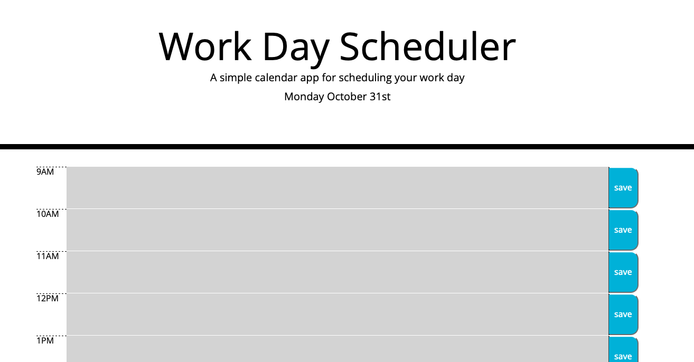

# work-day-scheduler

Description: This application uses javascript to generate an interactive calendar. The calendar displays the current date, and is divided into sections for standard business hours. The user can click into each section to enter an event, then click save when they are done, which will save their data to local storage.

Installation: N/A

Usage: Please visit this link: https://clairebain3.github.io/work-day-scheduler/

Credits N/A

License Please refer to the license in the repo

